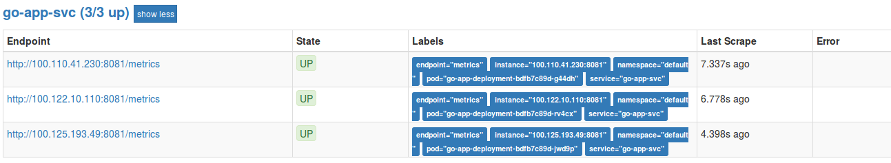

# go-app

The container listens on TCP port `8081` by default but it can be overwritten during runtime via environment variable and/or command line flag. For example:

```bash
$ go run server.go
2018/06/14 10:12:04 Starting the service listening on port :8081 ...

$ PORT=8084 go run server.go
2018/06/14 10:12:43 Starting the service listening on port :8084 ...

$ go run server.go -port=8090
2018/06/14 10:13:09 Starting the service listening on port :8090 ...
```

If both set the command line flag will have priority:

```bash
$ PORT=8084 go run server.go -port=8090
2018/06/14 10:13:30 Starting the service listening on port :8090 ...
```

The container offers liveness `/healthz` and readiness `/readyz` end points too for Kubernetes probes. It also simulates 10 seconds load time to make the readiness check more realistic as shown below.

```bash
$ go run server.go
2018/06/14 10:13:30 Starting the service listening on port :8081 ...
2018/06/14 10:13:30 Ready NOK
2018/06/14 10:13:40 Ready OK
```

The basic function of the server is returning the host name (or container name/id in Kubernetes) it is running on, number of requests and time stamp: 

```bash
igorc@igor-laptop:~$ curl http://localhost:8081/
I am: igor-laptop
Requests: 1
Time: Thu, 14 Jun 2018 10:20:38 AEST
igorc@igor-laptop:~$ curl http://localhost:8081/
I am: igor-laptop
Requests: 2
Time: Thu, 14 Jun 2018 10:20:40 AEST
igorc@igor-laptop:~$ curl http://localhost:8081/
I am: igor-laptop
Requests: 3
Time: Thu, 14 Jun 2018 10:20:43 AEST
```

It also has a `SIGINT` handle, as often happens in Kubernetes, so it can gracefully exit simulating a case when we need to clean up some temporary files or close database connections for example.

There is also a `/metrics` end point for Prometheus scraping and custom metrics example that simulates random failure when request with path `/checkrest?vendor=<random_name>` is made and increments a `error_curl_total` counter. So when hitting `https://localhost:8081/metrics` in the browser we should see the values for the `error_curl_total` custom metric:

```bash
# HELP error_curl_total Total curl request failed
# TYPE error_curl_total counter
error_curl_total{vendor="encompass"} 2
error_curl_total{vendor="google"} 2
error_curl_total{vendor="yahoo"} 1
...
```

amongst other default Go metrics collected by Prometheus.



The included `Makefile` can be used to build a local binary or build, run and push a Docker container to dedicated remote repository.
