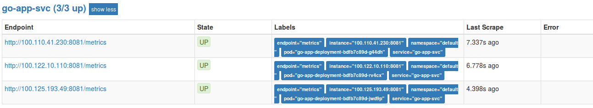

# go-app

The container listens on TCP port `8081` by default but it can be overwritten during runtime via environment variable and/or command line flag. For example:

```bash
$ go run ./src
2026/05/02 10:12:04 Starting the service listening on port :8081 ...

$ PORT=8084 go run ./src
2026/05/02 10:12:43 Starting the service listening on port :8084 ...

$ go run ./src -port=8090
2026/05/02 10:13:09 Starting the service listening on port :8090 ...
```

If both are set, the command line flag takes priority:

```bash
$ PORT=8084 go run ./src -port=8090
2026/05/02 10:13:30 Starting the service listening on port :8090 ...
```

## Endpoints

### `/` — root

Returns the hostname (or container name/ID in Kubernetes), request count, and timestamp:

```bash
$ curl http://localhost:8081/
I am: igor-laptop
Requests: 1
Time: Sat, 02 May 2026 10:20:38 AEST

$ curl http://localhost:8081/
I am: igor-laptop
Requests: 2
Time: Sat, 02 May 2026 10:20:40 AEST

$ curl http://localhost:8081/                                                                                                   
I am: igor-laptop                                                                                                                                  
Requests: 3                                                                                                                                        
Time: Sat, 02 May 2026 10:20:43 AEST
```

### `/healthz` and `/readyz` — Kubernetes probes

Liveness (`/healthz`) returns `200 OK` immediately. Readiness (`/readyz`) returns `503` for the first 10 seconds after startup to simulate a realistic load time, then switches to `200 OK`:

```bash
$ go run ./src
2026/05/02 10:13:30 Starting the service listening on port :8081 ...
2026/05/02 10:13:30 Ready NOK
2026/05/02 10:13:40 Ready OK
```

The delay can be overridden via the `READY_DELAY` env var or `-ready_delay` flag (value in seconds).

### `/version` — build metadata

Returns the release tag, git commit, and build timestamp as JSON:

```bash
$ curl http://localhost:8081/version
{"release":"v1.2.3","git_commit":"abc1234","build_time":"2026-05-02_10:00:00"}
```

### `/checkrest?vendor=<name>` — vendor failure simulation

Simulates a 50/50 random failure for the given vendor name and increments the `error_curl_total` Prometheus counter on failure. Repeated calls will produce different results:

```bash
$ curl http://localhost:8081/checkrest?vendor=google
Vendor status: ok

$ curl http://localhost:8081/checkrest?vendor=google
Failed to fetch
```

### `/metrics` — Prometheus scrape endpoint

Exposes default Go runtime metrics plus two custom metrics:

- `error_curl_total` — counter incremented on each `/checkrest` failure, labelled by vendor
- `http_response_time_seconds` — summary of request response times

```
# HELP error_curl_total Total curl request failed
# TYPE error_curl_total counter
error_curl_total{vendor="encompass"} 2
error_curl_total{vendor="google"} 2
error_curl_total{vendor="yahoo"} 1

# HELP http_response_time_seconds Request response times
# TYPE http_response_time_seconds summary
http_response_time_seconds_sum 0.0031
http_response_time_seconds_count 5
```

amongst other default Go metrics collected by Prometheus.



Metrics can optionally be served on a separate port via the `METRICS_PORT` env var or `-metrics_port` flag:

```bash
$ METRICS_PORT=9090 go run ./src
2026/05/02 10:13:30 Starting prometheus service listening on port :9090 ...
2026/05/02 10:13:30 Starting the service listening on port :8081 ...
```

## Version flag

```bash
$ go run ./src --version
release=v1.2.3 commit=abc1234 built=2026-05-02_10:00:00
```

## Building

Use `make` to produce the `go-app` binary (linux/amd64). The default target runs format check, lint, and build in sequence:

```bash
$ make
```

Or run each stage individually:

```bash
$ make fmt    # check formatting with gofmt
$ make lint   # run golint against ./src/...
$ make test   # run tests with -race flag
$ make build  # compile and produce ./go-app binary
```

The build injects version metadata via `-ldflags`:

```bash
$ ./go-app --version
release=v1.2.3 commit=abc1234 built=2026-05-02_10:00:00
```

## Environment variables and flags

| Variable / Flag | Default | Description |
|----------------|---------|-------------|
| `PORT` / `-port` | `8081` | Main HTTP port |
| `METRICS_PORT` / `-metrics_port` | (same as PORT) | Separate Prometheus metrics port |
| `READY_DELAY` / `-ready_delay` | `10` | Seconds before readiness probe returns OK |
